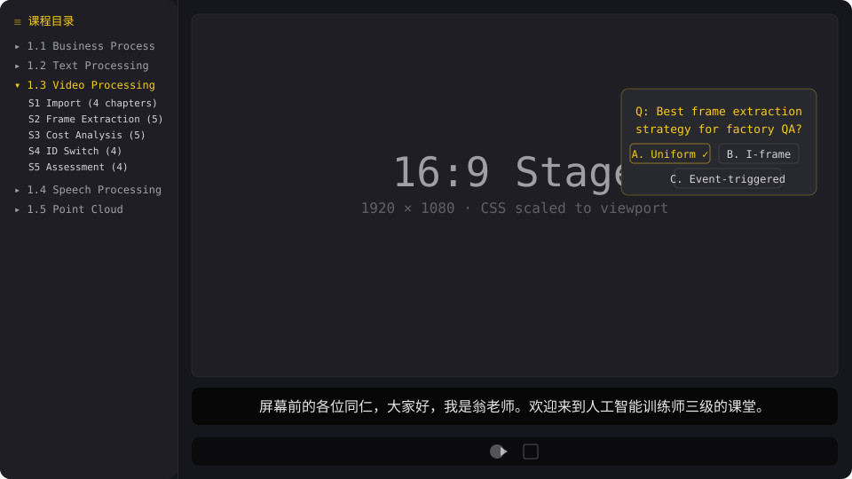

# Course Forge · 课件锻造台

**将知识文档转化为分段式互动课件 — 带旁白配音、测验题、3D探索和嵌入式评估。**

[English](./README.md) · [中文文档](./README.zh-CN.md)

---

`course-forge` 构建可用于录屏的 Vite + React + TypeScript 互动式课件。从一份知识文档或口播稿开始，技能会引导你完成章节规划、互动章节开发、TTS 语音合成、字幕时序生成和部署——每个关键节点都有硬性的人工确认。

**源于 280+ 章的生产级课件开发**，覆盖文本、视频、语音、点云等多模态数据处理等教学场景。

---

## 安装

### 方式 A · `skills` CLI (npx) — 推荐

```bash
# 完整安装（模板 + 主题 + 脚本）
npx skills add xmwengxing/course-forge

# 最小安装（仅 SKILL.md + references + scripts）
npx skills add xmwengxing/course-forge -s course-forge --minimal
```

### 方式 B · 手动复制

```bash
git clone https://github.com/xmwengxing/course-forge.git
cp -r course-forge /你的项目/.opencode/skills/
```

---

## 快速开始

```bash
npx skills add xmwengxing/course-forge
bash .opencode/skills/course-forge/scripts/scaffold.sh ./my-course --theme=chalk-garden
```

然后对 AI 说："用 course-forge 从 docs/xxx.md 创建课件"

---

## 核心能力

| 能力 | course-forge |
|:--|:--|
| 产出物 | **多章节完整课程 (S1-S5)** |
| 交互能力 | **选择题、简答题、CSS 3D 探索** |
| 章节管理 | **course.json 三级架构 + 自动生成脚本** |
| 字幕系统 | 字数占比分配 ms、60字阈值、0-indexed 对齐 |
| 评估体系 | **柯氏四级评估 (L1-L4 嵌入每个 S5)** |
| 嵌入方案 | **5 种 Web 应用集成策略** |
| 画布优化 | 缩小 stage-pad/margin，可用面积提升 18% |

---

---

## 工作流

技能遵循结构化流水线，在关键决策点设置人工确认节点：

```
  用户提供知识文档 / 课件大纲 / 口播稿
                 │
  ┌──────────────┴──────────────┐
  │ Phase 0 — 输入与内容准备 ▼  │
  │  0.1  识别输入类型          │
  │  0.2  生成口播稿            │        用户审阅 docs/xxx.md
  │       （如未提供）           │
  │  0.3  提出 S1-S5 拆分方案   │        用户确认章节数 + 时长预估
  │  0.4  选择主题              │
  └──────────────┬──────────────┘
                 ▼
  ┌──────────────┴──────────────┐
  │ Phase 1 — 逐段开发          │
  │  1.1  脚手架搭建            │
  │  1.2  开发 S1 → 验收       │◄── 逐段验收，每段汇报时长
  │  ...  开发 S2 → 验收       │
  │  1.N  开发 S5 → 验收       │
  └──────────────┬──────────────┘
                 ▼
  ┌──────────────┴──────────────┐
  │ Phase 2 — 音频与字幕        │
  │  2.1  合成旁白音频          │    TTS（MiniMax / OpenAI / Edge）
  │  2.2  压缩音频（可选）      │    64kbps → 体积减半
  │  2.3  生成字幕时序          │    ffprobe 实测时长切分
  └──────────────┬──────────────┘
                 ▼
  ┌──────────────┴──────────────┐
  │ Phase 3 — 构建与本地验收    │
  │  3.1  npm run build → dist/ │    纯静态文件，独立自包含
  │  3.2  本地预览验收          │    npx serve dist → 用户验收入
  └──────────────┬──────────────┘
                 ▼
  ┌──────────────┴──────────────┐
  │ Phase 4 — 部署与嵌入        │
  │  4.1  独立站点部署          │    Nginx / CDN / Docker / GitHub Pages
  │  4.2  嵌入已有 Web 应用     │    新窗口 / iframe / DB 驱动
  └─────────────────────────────┘
```

### 分工：你决定什么

| 步骤 | 你决定 | AI 执行 |
|------|:--:|------|
| 口播稿 | 审阅通过或提出修改 | 从源文档生成 |
| S1-S5 拆分 | 确认章节数 × 时长 | 提出最优拆分方案 |
| 主题 | 选择（教学推荐 chalk-garden） | 展示主题选项 |
| 每段验收 (S1-S5) | 审阅画面 + 时长 | 构建章节 + 音频管线 |
| 音频合成 | 确认后执行 | TTS + 压缩 + 字幕 |

---

## 课程结构



```
course/
├── course.json              # 段/节/章 三级架构
├── presentation/
│   ├── src/chapters/        # 每章一个目录 (TSX+CSS+narrations.ts)
│   ├── public/audio/        # TTS 合成音频 (gitignored)
│   └── public/subtitle-timing.json
└── regenerate-course-json.py
```

## 主题

23 个内置主题，每个有独立的设计签名、字体和动效风格。`references/THEMES.md` 包含完整 token 契约。

---

## AI 交互式课件 vs 人工录播视频

基于 280+ 章生产级课件开发经验的逐项对比。

| 对比维度 | AI 交互式课件 (`course-forge`) | 人工录播视频 |
|---|---|---|
| **存储容量占用** | 🟢 单章 ~160 KB（TSX+CSS+压缩 64kbps MP3）；23 章课程 ≈ 3.5 MB | 🔴 720p MP4 每 45 分钟课程 50-200 MB；多课件库轻松超 10 GB |
| **交互元素** | 🟢 全谱系支持：点击揭示注释、拖拽旋转 3D 场景、排序测验、判定树遍历、手风琴展开/收起、VS 对照裁决面板、实时指标计算器 | 🔴 无交互——纯被动线性播放。测验需依赖单独的 LMS 平台 |
| **课件局部调整** | 🟢 编辑单章 `narrations.ts` → 构建 → 部署。无需重新录制。修复错别字或新增章节仅需数分钟 | 🔴 需重新录制整个视频段落、重新编辑时间轴、重新导出。修正 30 秒内容可能耗时 2 小时以上 |
| **跨平台兼容性** | 🟡 任意现代浏览器均可渲染（Chrome/Firefox/Safari/Edge）。自适应 Stage 缩放适配桌面、平板、手机。Fullscreen API + 横屏锁定支持移动端全屏 | 🟢 MP4 几乎可在任何设备播放——浏览器、播放器、智能电视、幻灯片嵌入。老旧设备兼容性稍好 |
| **权限控制与版权保护** | 🟢 通过 Web 服务端认证中间件、Token 鉴权、域名白名单或付费墙实现完全访问控制。源代码（TSX/CSS/narrations）可通过后端路由保护 | 🔴 MP4 文件一旦下载，可被自由复制、重新上传或盗版。DRM 方案昂贵且极易绕过 |
| **主题丰富度与扩展性** | 🟢 23 套内置主题，每套有独立的设计签名（字体搭配、调色板、动效曲线）。5 种语义色 token（`--accent`/`--accent-tech`/`--accent-good`/`--accent-warn`/`--accent-deep`）。通过 CSS 变量覆盖即可新增主题 | 🟡 视觉风格在录制时即被"烤定"——背景、叠加层、字幕条的样式不可更改。换风格需重新拍摄或视频后期制作 |
| **配音自由度** | 🟢 Provider-agnostic TTS 管线：MiniMax（中文优化）、OpenAI、Edge-TTS 或自定义提供商。可独立重合成任意单章音频。可按章节切换不同声音、语速、语言 | 🔴 依赖真人旁白。重新录制需预约录音棚/配音员、保持与现有段落语气一致性、重新同步——昂贵且缓慢 |
| **开发效率** | 🟡 初期开发：45 分钟课程约 2-4 小时（口播稿编写+TSX 布局+CSS+音频合成）。首课后通用组件显著加速后续课程。**借助 AI 辅助可单次会话开发 60 章（3 门课）** | 🔴 典型制作流程：脚本撰写→彩排→影棚录制→后期剪辑→导出。精良的 45 分钟视频通常需 2-5 个工作日 |
| **离线使用** | 🟡 首次加载后即可离线使用（静态 Vite 构建产物）。音频以 MP3 资产预加载。可通过 Service Worker 缓存实现完整离线 PWA 模式 | 🟢 MP4 文件可下载后在任意设备离线播放，零技术门槛 |
| **内容可检索性** | 🟢 章节标题、口播文本、交互提示均为纯文本（TypeScript），部署为静态 HTML 时可被搜索引擎完全索引 | 🔴 视频内容是不透明的——需要人工转录或自动生成字幕才能检索。字幕往往滞后于内容更新 |
| **学员数据追踪** | 🟢 内置：逐步进度追踪、测验答案记录、完播率、每章停留时长、互动参与度指标。数据直接输入柯氏 L1-L4 评估模型 | 🔴 需依赖外部 LMS（学习管理系统）或带分析插件的视频托管平台。通常仅限播放/暂停/完成事件 |
| **真人临场感** | 🔴 无真实人脸、肢体语言或现场感染力。依赖视觉设计质量和交互性来维持学员注意力 | 🟢 真人讲师的表情、手势和声音细节营造亲密连接感。肢体语言有助于理解 |
| **物理实操演示** | 🔴 限于 2D/3D 模拟可视化。无法展示真实物理操作、实验实操或工具亲手使用过程 | 🟢 可展示真实操作、物理演示、白板草图、工具操作讲解 |
| **实时互动适应** | 🔴 预编写逻辑——无法动态响应单名学员的个性化提问或根据现场观众反馈调整节奏 | 🟡 在直播或教室环境中，讲师可暂停答疑、即时调整示例、感知现场氛围 |

### 选型建议

| 场景 | 推荐方案 |
|---|---|
| 大规模标准化培训（1000+ 学员） | **AI 交互式课件** — 品质一致，零边际交付成本 |
| 内容频繁更新迭代 | **AI 交互式课件** — 数分钟内完成单章修改 |
| 需要测验、动手练习、决策判断训练 | **AI 交互式课件** — 内置交互能力 |
| 领导力/主题演讲/品牌宣传 | **人工录播视频** — 需要真人感染力 |
| 物理实操技能培训（实验室、车间、体育） | **人工录播视频** — 需要真实展示 |
| 学员数据分析与合规追踪 | **AI 交互式课件** — 原生数据采集能力 |
| 新课程概念快速验证 | **AI 交互式课件** — 数小时内开发并迭代 |
| 高风险认证考试备考 | **混合模式** — AI 交互课件承载内容 + 人工监考 |

course-forge — 45-60 分钟互动课件开发工具，支持互动评估、3D 探索和多模态数据处理。

---

## 许可证

[MIT](./LICENSE) © [xmwengxing](https://github.com/xmwengxing)
